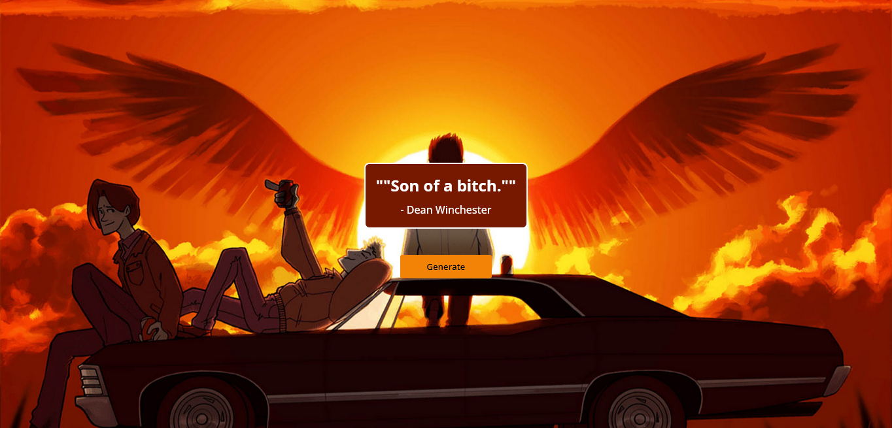
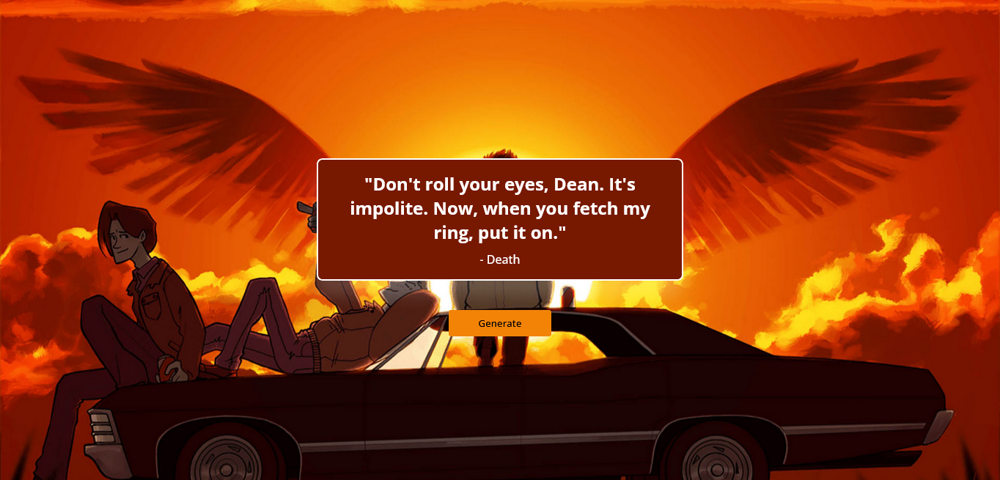

# Supernatural-Quotes-Generator 

This is My %th Project using API - This Project Generate random Supernatural Quotes

 

## **Built With**

-    
-    

 

## **Outcome**

* Tried **BEM Methodology** which helped me to write clean code in css
* Used HTML5 **semantic elements** for better accessability and readability
* Practiced **mobile first workflow** which ensures responsive layout
* Used **Git** and **GitHub** for project management
* Tried to maintain **clean code**
* **Cross tested** on Firefox and Chromium based browsers
